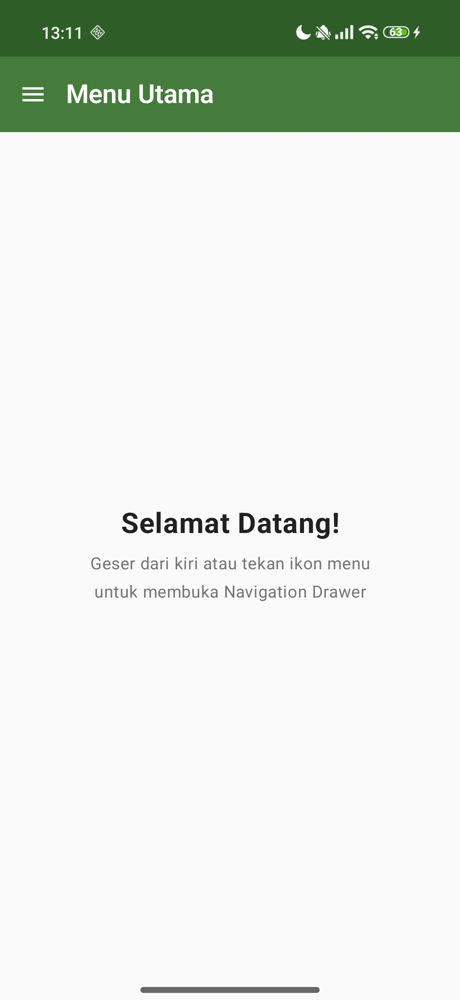
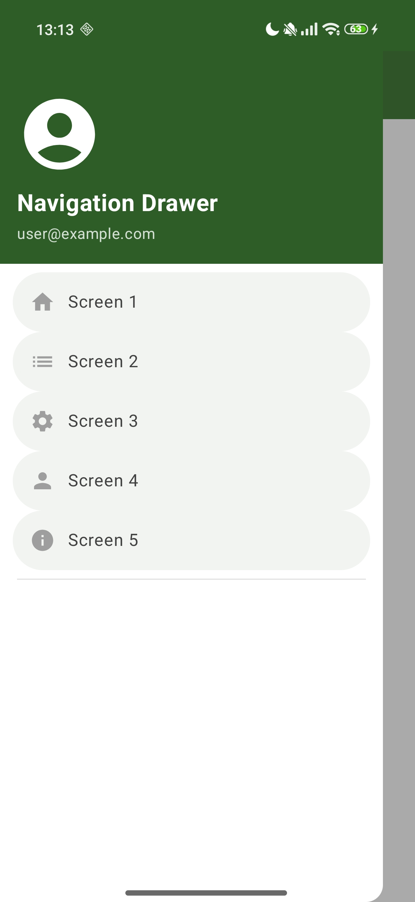
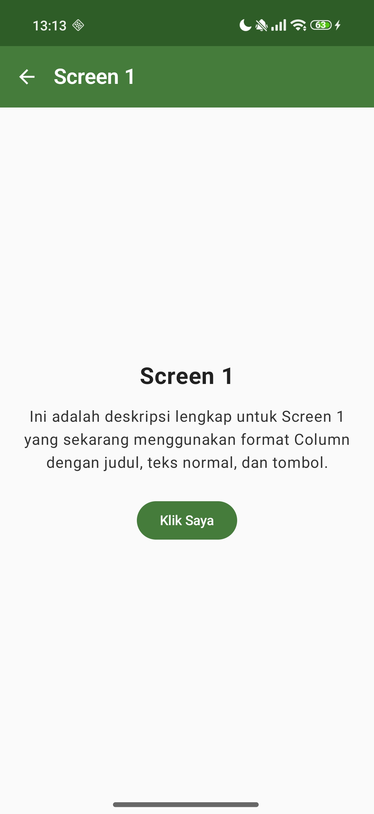
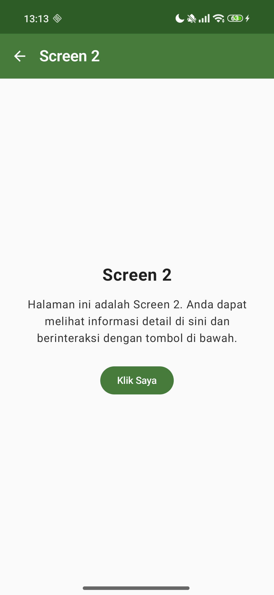
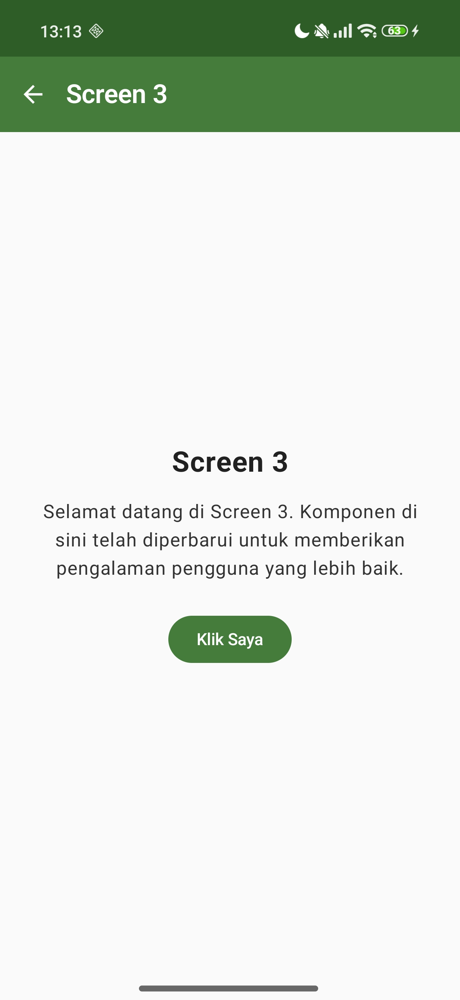
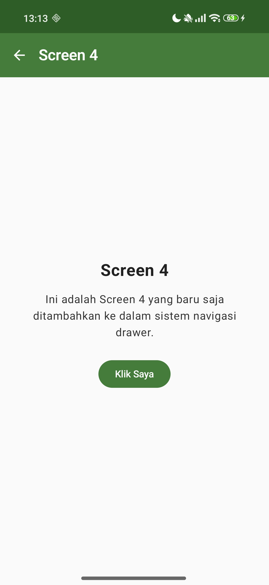

# NavDrawer - Simulasi Navigation Drawer
## Android Jetpack Compose Project

### Identitas Mahasiswa
- **Nama**: Willy Rafael F. Silalahi
- **NIM**: 23083000168
- **Kelas**: 6A2
- **Matakuliah**: Pemrograman Mobile
- **Instansi**: Universitas Merdeka Malang

---

### Deskripsi
Aplikasi Android yang mendemonstrasikan implementasi **Navigation Drawer** menggunakan Jetpack Compose dan Material3. Proyek ini telah dikembangkan lebih lanjut dengan penambahan fitur navigasi, perubahan tema warna, dan peningkatan UI pada setiap halaman.

---

### Perubahan Terbaru (Update)
- **Tema Warna Baru**: Mengubah warna utama menjadi Hijau (#2E7D32) untuk memberikan tampilan yang lebih segar.
- **Ekspansi Menu**: Menambahkan **Screen 4** dan **Screen 5** ke dalam Navigation Drawer.
- **Ikon Kustom**: Setiap menu drawer kini memiliki ikon yang berbeda dan representatif.
- **UI Konten Terstruktur**: Setiap layar kini menggunakan tata letak `Column` yang terdiri dari Judul (Bold), Deskripsi (Normal), dan sebuah Tombol aksi.
- **Header Drawer**: Menambahkan avatar/foto profil pada bagian header drawer.
- **Badge Aktif**: Menambahkan indikator "Aktif" pada item menu yang sedang dipilih di drawer.

---

### Struktur Project

```
NavDrawerApp/
├── app/src/main/
│   ├── java/com/example/navdrawerapp/
│   │   ├── MainActivity.kt                    ← Activity utama (entry point)
│   │   └── ui/
│   │       ├── components/
│   │       │   └── DrawerContent.kt            ← Isi Navigation Drawer (menu + avatar + badge)
│   │       ├── navigation/
│   │       │   ├── NavigationRoutes.kt         ← Definisi route (Home, Screen 1-5)
│   │       │   └── NavGraph.kt                 ← Peta navigasi antar halaman
│   │       ├── screens/
│   │       │   ├── HomeScreen.kt               ← Halaman utama + Drawer
│   │       │   ├── ScreenContent.kt            ← Komponen generik screen (Title, Desc, Button)
│   │       │   ├── Screen1.kt                  ← Halaman Screen 1
│   │       │   ├── Screen2.kt                  ← Halaman Screen 2
│   │       │   ├── Screen3.kt                  ← Halaman Screen 3
│   │       │   ├── Screen4.kt                  ← Halaman Screen 4 (Baru)
│   │       │   └── Screen5.kt                  ← Halaman Screen 5 (Baru)
│   │       └── theme/
│   │           ├── Color.kt                    ← Warna Hijau (sinkron color.xml)
│   │           └── Theme.kt                    ← Tema Material3
│   └── res/values/
│       ├── color.xml                           ← Definisi warna hexadecimal (Green theme)
│       ├── strings.xml                         ← String resources
│       └── themes.xml                          ← Tema XML
```

---

### Screenshots

| **Menu Utama** | **Navigation Drawer** |
| :---: | :---: |
|  |  |
| *Halaman selamat datang saat aplikasi pertama kali dibuka.* | *Panel samping dengan avatar, menu berikon, dan badge aktif.* |

| **Screen 1** | **Screen 2** | **Screen 3** |
| :---: | :---: | :---: |
|  |  |  |
| *Konten terstruktur (Judul, Deskripsi, Button) tema hijau.* | *Konten terstruktur (Judul, Deskripsi, Button) tema hijau.* | *Konten terstruktur (Judul, Deskripsi, Button) tema hijau.* |

| **Screen 4** | **Screen 5** |
| :---: | :---: |
|  |  |
| *Konten terstruktur (Judul, Deskripsi, Button) tema hijau.* | *Konten terstruktur (Judul, Deskripsi, Button) tema hijau.* |

---

### Alur Navigasi

```
┌─────────────────────┐
│   HomeScreen        │
│   (Navigation       │──── Geser kiri / tap ikon ≡
│    Drawer)          │
└────────┬────────────┘
         │
    ┌────┼────┬────┬────┐
    ▼    ▼    ▼    ▼    ▼
Screen1  Screen2  Screen3  Screen4  Screen5
    │    │    │    │    │
    └────┴────┴────┴────┘
         │ (Back Arrow)
         ▼
    HomeScreen
```

---

### Cara Menjalankan

1. Buka Android Studio
2. Pilih **File → Open** → arahkan ke folder `NavDrawerApp`
3. Tunggu Gradle sync selesai
4. Klik **Run** (▶) atau tekan Shift + F10
5. Pilih emulator atau device fisik

---

### Dependencies Utama

| Library                | Kegunaan                          |
|------------------------|-----------------------------------|
| Jetpack Compose BOM    | UI toolkit modern                 |
| Material3              | Desain komponen Material You      |
| Navigation Compose     | Navigasi antar halaman            |
| Material Icons Extended| Ikon tambahan (Menu, ArrowBack)   |

---

